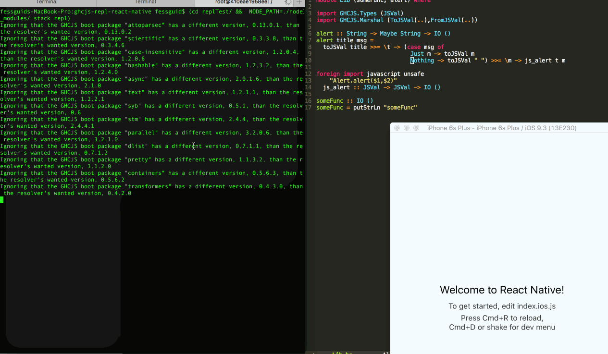

# ghcjs-repl-react-native
Experiment of bringing ghcjs REPL to React Native. Bring such repl to React Native environment:



## Plan

ghcjs has a REPL already, it contains of two parts:

- Server side which opens a socket and waits until client connects to that
- Client side [ghcjsiClient.js](https://github.com/ghcjs/ghcjs/blob/7aa7bae05b306bdb8f7a9c6e292ce74736e4541d/lib/etc/ghcjsiClient.js) which using socket.io library just connects to the open websocket.

RN environment has it's own websocket client implementation and we should use it, rather that bringing socket.io

## Implementation

Current repo was initialized using following commands:

``` bash
stack init replTest # add ghcjs compiler settings to replTest/stack.yaml
react-native init replProject && cd replProject
npm install base64 socket.io-client --save
curl https://raw.githubusercontent.com/ghcjs/ghcjs/master/lib/etc/ghcjsiClient.js >> ghcjsRNClient.js
```

Later on following changes were applied to the ghcjs repl client:
`curl https://raw.githubusercontent.com/ghcjs/ghcjs/master/lib/etc/ghcjsiClient.js | diff - replProject/ghcjsRNClient.js`

``` diff
< var h$GHCJSiSocket = io();
---
> // socket.io expects to have a navigator available, set it here
> window.navigator.userAgent = "react-native";
>
> // JavaScriptCore doesn't have btoa and atob global functions, expose those
> var {btoa,atob} = require('Base64')
> GLOBAL.btoa = btoa
> GLOBAL.atob = atob
>
> // Require socket.io client
> var io = require("socket.io-client/socket.io");
>
> // Specify host and port to connect to and more importantly specify the transport
> var h$GHCJSiSocket = io('ws://localhost:6400',{transports: ['websocket']});
4c13
< var h$GHCJSi = { socket: io()
---
> var h$GHCJSi = { socket: io('ws://localhost:6400',{transports: ['websocket']})
55c64
>
154c163
<     if(arr.length <= 60000) {
---
> // 60k causes stackoverflow exception, looks like JavaScriptCore cannot handle that much. 10k works fine
>     if(arr.length <= 10000) {
158,159c167,168
<     for(var i=0;i<arr.length;i+=60000) {
< 	r += String.fromCharCode.apply(this, arr.slice(i, i+60000));
---
>     for(var i=0;i<arr.length;i+=10000) {
> 	r += String.fromCharCode.apply(this, arr.slice(i, i+10000));
162a172,174
>
> // Compiled ghcjs application expects to have h$GHCJSi as a global and in order to use repl it has to be exposed
> // as global.h$GHCJSi as well
> GLOBAL.global = {h$GHCJSi: h$GHCJSi}
> GLOBAL.h$GHCJSi = h$GHCJSi
```

Once it's done you can have a repl:

``` bash
(cd replProject/ && react-native run-ios)
(cd replTest/ &&  NODE_PATH=./node_modules/ stack repl)
```
